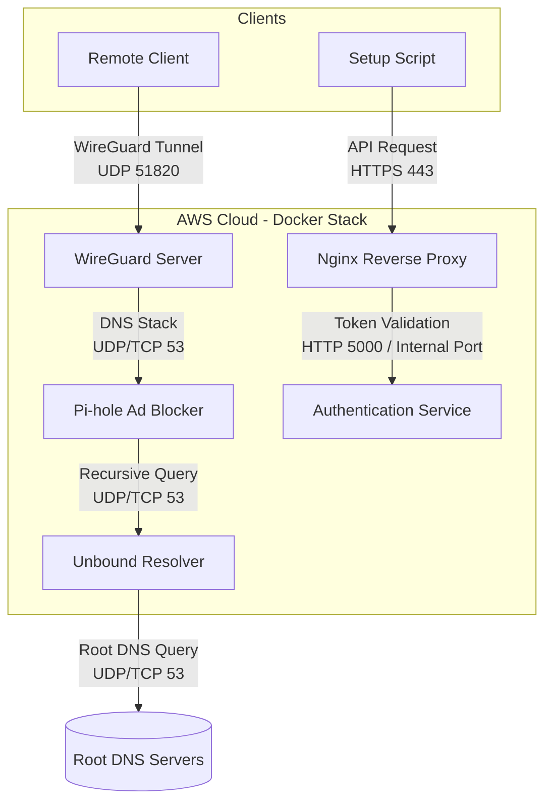

```mermaid
graph TD

subgraph Clients
    RC[Remote Client]
    SS[Setup Script]
end

subgraph AWS["AWS Cloud - Docker Stack"]

    WG[WireGuard Server]

    PH[Pi-hole Ad Blocker]

    UB[Unbound Resolver]

    RP[Nginx Reverse Proxy]

    AS[Authentication Service]

end

RC -->|WireGuard Tunnel<br/>UDP 51820| WG
WG -->|DNS Stack<br/>UDP/TCP 53| PH
PH -->|Recursive Query<br/>UDP/TCP 53| UB

SS -->|API Request<br/>HTTPS 443| RP
RP -->|Token Validation<br/>HTTP 5000 / Internal Port| AS

UB -->|Root DNS Query<br/>UDP/TCP 53| ROOT[(Root DNS Servers)]
```