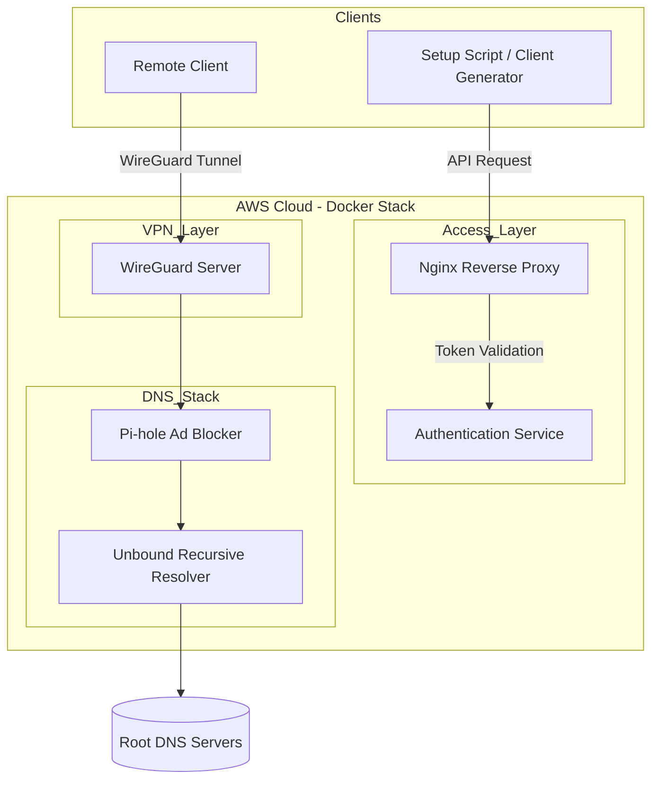

```mermaid
graph TD

subgraph Clients
    RC[Remote Client]
    SS[Setup Script / Client Generator]
end

subgraph AWS["AWS Cloud - Docker Stack"]

    subgraph Access_Layer
        RP[Nginx Reverse Proxy]
        AS[Authentication Service]
    end

    subgraph VPN_Layer
        WG[WireGuard Server]
    end

    subgraph DNS_Stack
        PH[Pi-hole Ad Blocker]
        UB[Unbound Recursive Resolver]
    end

end

RC -->|WireGuard Tunnel| WG
SS -->|API Request| RP
RP -->|Token Validation| AS

WG --> PH
PH --> UB
UB --> ROOT[(Root DNS Servers)]
```